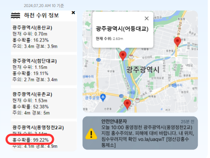
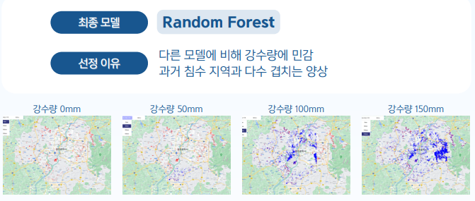
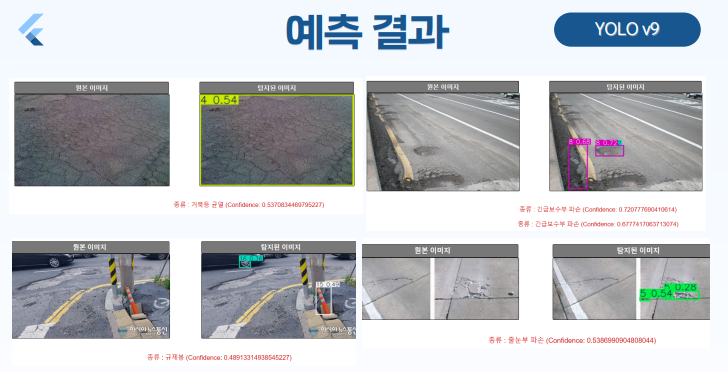
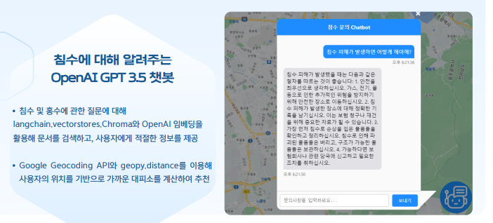
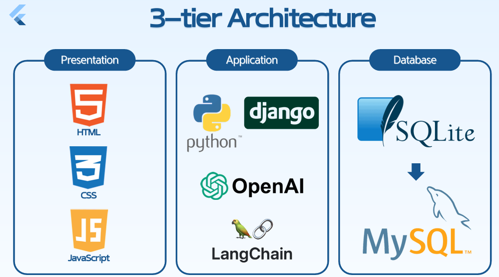

# 디지털 트윈 기반 도시침수 스마트 대응 시스템

### : KT AIVLE School 5기 Big Project - AI트랙 9반 26조

## 프로젝트 설명

**광주광역시 도시 침수 대응 시스템**은 도시침수 및 홍수와 같은 현실적인 수해로 인한 피해를 최소화하고, 피해 해결을 돕기 위한 서비스입니다. 실제 침수 피해 발생 시, 지자체의 대응 시스템이 현업 부서별로 각각 운영되고, 국가 하천과 지방 하천의 관리 주체가 달라 신속한 대응이 어려운 상황을 보완합니다. 이 시스템은 담당 공무원부터 일반 사용자까지 하나의 플랫폼을 통해 침수 대응 및 후속 대응을 지원합니다.

## 주요특징

### Logistic Regression을 이용한 홍수 확률 제공 및 실시간 하천 수위



- 선형 모델: 강수량, 수위 등 선형성을 갖는 데이터에 적합
- 해석 가능: 각 변수의 계수를 직접적으로 해석 가능
- 명확한 관계: 변수와 종속 변수 간의 관계를 명확히 이해

### RandomForest를 이용한 침수 예상 지역 확인 및 과거 침수 지역 비교 가능



- 민감도: 다른 모델에 비해 강수량에 민감
- 비교 가능: 과거 침수 지역과 다수 겹치는 양상

### yolov9를 이용한 도로이상탐지



- 높은 정확도와 빠른 속도
- 실시간 object detection 가능
- 단일 신경망 구조: 효율성과 적용 가능성 보유

### 챗봇을 통한 침수 대응 메뉴얼 및 대피소 정보 제공



- 문서 검색: langchain, vectorstores, ChromaDB와 OpenAI 임베딩을 활용
- 적절한 정보 제공: 사용자가 필요로 하는 정보를 제공

## 파일 구조

```
/Service
|-- /ToDoList         # Client-side code
|   |-- /ToDoList       # Django Setting files
|   |-- /board         #
|   |-- /board_data         #
|   |-- /chatbot         #
|   |-- /data        #
|   |-- /detect        #
|   |-- /find_ps        #
|   |-- /find_username        #
|   |-- /images        #
|   |-- /login        #
|   |-- /main        #
|   |-- /media        #
|   |-- /rain        #
|   |-- /signup        #
|   |-- /templates        #
|   |-- /terms        #
|   |-- /uploads        #
|   |-- /waterlevel        #
|   |-- package.json  #
|-- /myvenv           # Virtual-Environment
|   |-- 이건 안 넣어도 되지 않나?     # Server setup and endpoints
|-- .gitignore        # Specifies intentionally untracked files to ignore
|-- requirements.txt  # Script to install client dependencies
|-- README.md         # This file
```

## 기술 스택



## Dependencies

```
flood-dashboard@1.0.0
|-- django==3.2.6
|-- langchain-openai==0.1.15
|-- langchain-community==0.2.7
|-- openai==1.35.13
|-- geopy
|-- faiss-cpu
|-- tiktoken
|-- rank_bm25
|-- openpyxl
|-- scikit-learn==1.5.0
|-- torch==2.3.1
|-- ultralytics==8.2.57
|-- pydantic==2.8.2
|-- django-environ>=0.4.5
|-- chromadb==0.5.0
|-- numpy==1.24.3
```

## Developer Info.

| 성명                                      | 역할                                                                                                                   |
| ----------------------------------------- | ---------------------------------------------------------------------------------------------------------------------- |
| [소부승](https://github.com/bootkorea)    | PM, 도로 파손 탐지(모델 설계, 모델 고도화), 홍수 예측(모델 설계, 데이터 전처리), 챗봇(모델 설계), 관련 Backend 구현    |
| [고병진](https://github.com/gobyeongjin)  | 홍수 예측(모델 고도화), 침수 지역 예측(모델 설계, 데이터 전처리), 챗봇(모델 고도화), 관련 Frontend 구현                |
| [윤서연](https://github.com/syu357)       | 침수 지역 예측(데이터 전처리), 챗봇(데이터 전처리), 도로 파손 탐지(모델 설계), 관련 Frontend 구현                      |
| [이주헌](https://github.com/leejugwi)     | 침수 지역 예측(AI 모델 설계, 데이터 전처리), 홍수 예측 (모델 고도화), 챗봇(모델 설계, 데이터 전처리), 관련 프론트 구현 |
| [김수빈](https://github.com/subin16)      | Frontend(Login/Signup, MyPage) 프론트엔드, Backend(과거침수 지역, 대피소, 강수량), Design                              |
| [박경민](https://github.com/PNamju)       | Frontend(NavBar, Notice, 도로 파손 탐지), Design                                                                       |
| [정유리](https://github.com/jeongYuri)    | Backend(Notice/User Data CRUD, SignIn, MyPage), DBA, 마이페이지 백엔드 구현, Design                                    |
| [황인태](https://github.com/dlsxodlsghks) | Frontend(구별 하천 수위), Backend(구별 하천 수위), Code Formatting                                                     |
| [홍기원](https://github.com/Hongwon123)   | Backend(구별 하천 수위, 챗봇, Login/Signin, 아이디/비밀번호 찾기, MainPage), Frontend(MainPage)                        |
