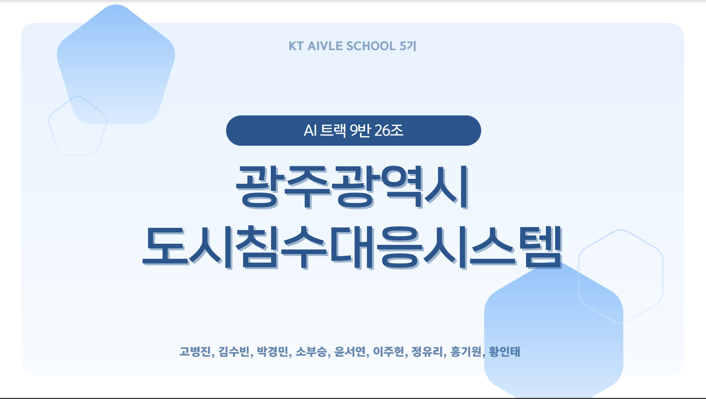

# 디지털 트윈 기반 도시침수 스마트 대응 시스템

### : KT AIVLE School 5기 Big Project - AI트랙 9반 26조



## 프로젝트 설명

**광주광역시 도시 침수 대응 시스템**은 도시침수 및 홍수와 같은 현실적인 수해로 인한 피해를 최소화하고, 피해 해결을 돕기 위한 서비스입니다. <br/> 실제 침수 피해 발생 시, 지자체의 대응 시스템이 현업 부서별로 각각 운영되고, 국가 하천과 지방 하천의 관리 주체가 달라 신속한 대응이 어려운 상황을 해결하기 위해 수행한 프로젝트이며, 이를 활용하여 담당 공무원부터 일반 사용자까지 하나의 플랫폼을 통해 침수 대응 및 후속 대응에 기여합니다.

## 구동 가이드

```
cd service
python -m venv {가상환경_이름} # Python 가상 환경 사용하는 경우 (1)
. {가상환경_이름}/Scripts/activate # Python 가상 환경 사용하는 경우 (2)
cd ToDoList
pip install -r requirements.txt
python manage.py runserver
```

## 주요특징

### Logistic Regression 기반 "홍수 확률 제공" 및 "실시간 하천 수위" 확인


- 선형 모델: 강수량, 수위 등 선형성을 갖는 데이터에 적합
- 해석 가능: 각 변수의 계수를 직접적으로 해석 가능
- 명확한 관계: 변수와 종속 변수 간의 관계를 명확히 이해

### Random Forest 기반 "침수 예상 지역 확인" 및 "과거 침수 지역 비교" 가능


- 민감도: 다른 모델에 비해 강수량에 민감
- 비교 가능: 과거 침수 지역과 다수 겹치는 양상

### YOLO 기반 공공시설물 이상 탐지


- 높은 정확도와 빠른 속도
- 실시간 object detection 가능
- 단일 신경망 구조: 효율성과 적용 가능성 보유

### 침수 대응 메뉴얼 및 대피소 정보 제공 ChatBot


- 문서 검색: langchain, vectorstores, ChromaDB와 OpenAI 임베딩을 활용
- 적절한 정보 제공: 사용자가 필요로 하는 정보를 제공

## 파일 구조

```
/Service
|-- /ToDoList            # Client-side code
|   |-- /ToDoList        # Django Setting files
|   |-- /board           # Notice files
|   |-- /board_data      # Notice data storage
|   |-- /chatbot         # AI Chatbot files
|   |-- /data            # Service .csv storage
|   |-- /detect          # AI Damaged facility Detection files
|   |-- /find_ps         # find-userPW files
|   |-- /find_username   # find-userID files
|   |-- /images          # AI Damaged facility Detection Image storage
|   |-- /login           # Login files
|   |-- /main            # MAINPAGE files
|   |-- /media           # Service data storage
|   |-- /rain            # AI - amount of precipitation files
|   |-- /signup          # Signup files
|   |-- /templates       # Service Web view side
|   |-- /terms           # Terms of service files
|   |-- /uploads         # Service Image storage
|   |-- /waterlevel      # AI - Water level files
|-- /myvenv              # Virtual-Environment
|-- /img                 # README Image storage
|-- .gitignore           # Specifies intentionally untracked files to ignore
|-- requirements.txt     # Script to install client dependencies
|-- README.md            # This file
```

## 기술 스택


## Dependencies

```
flood-dashboard@1.0.0
|-- django==3.2.6
|-- langchain-openai==0.1.15
|-- langchain-community==0.2.7
|-- openai==1.35.13
|-- geopy
|-- faiss-cpu
|-- tiktoken
|-- rank_bm25
|-- openpyxl
|-- scikit-learn==1.5.0
|-- torch==2.3.1
|-- ultralytics==8.2.57
|-- pydantic==2.8.2
|-- django-environ>=0.4.5
|-- chromadb==0.5.0
|-- numpy==1.24.3
```

## Developer Info.

| 성명                                      | 역할                                                                                                                                                                                      |
| ----------------------------------------- | ----------------------------------------------------------------------------------------------------------------------------------------------------------------------------------------- |
| [소부승](https://github.com/bootkorea)    | $\cdot$ Product Manager <br/> $\cdot$ 도로 파손 탐지(모델 설계, 모델 고도화), 홍수 예측(모델 설계, 데이터 전처리), 챗봇(모델 설계) <br/> $\cdot$ Backend(도로 파손 탐지, 홍수 예측, 챗봇) |
| [고병진](https://github.com/gobyeongjin)  | $\cdot$ 홍수 예측(모델 고도화), 침수 지역 예측(모델 설계, 데이터 전처리), 챗봇(모델 고도화) <br/> $\cdot$ Frontend(홍수 예측, 침수 지역 예측, 챗봇)                                       |
| [윤서연](https://github.com/syu357)       | $\cdot$ 침수 지역 예측(데이터 전처리), 챗봇(데이터 전처리), 도로 파손 탐지(모델 설계), <br/> $\cdot$ Frontend(침수 지역 예측, 챗봇, 도로 파손 탐지)                                       |
| [이주헌](https://github.com/leejugwi)     | $\cdot$ 홍수 예측 (모델 고도화), 침수 지역 예측(AI 모델 설계, 데이터 전처리), 챗봇(모델 설계, 데이터 전처리) <br/> $\cdot$ Frontend(홍수 예측, 침수 지역 예측, 챗봇)                      |
| [김수빈](https://github.com/subin16)      | $\cdot$ Frontend(Login/Signup, MyPage) <br/> $\cdot$ Backend(과거침수 지역, 대피소, 강수량) <br/> $\cdot$ Design                                                                          |
| [박경민](https://github.com/PNamju)       | $\cdot$ Frontend(NavBar, Notice, 도로 파손 탐지) <br/> $\cdot$ Design                                                                                                                     |
| [정유리](https://github.com/jeongYuri)    | $\cdot$ Backend(Notice/User Data CRUD, SignIn, MyPage) <br/> $\cdot$ DBA <br/> $\cdot$ Design                                                                                             |
| [황인태](https://github.com/dlsxodlsghks) | $\cdot$ Frontend(구별 하천 수위) <br/> $\cdot$ Backend(구별 하천 수위) <br/> $\cdot$ Code Formatting                                                                                      |
| [홍기원](https://github.com/Hongwon123)   | $\cdot$ Backend(구별 하천 수위, 챗봇, Login/Signin, 아이디/비밀번호 찾기, MainPage) <br/> $\cdot$ Frontend(MainPage)                                                                      |
